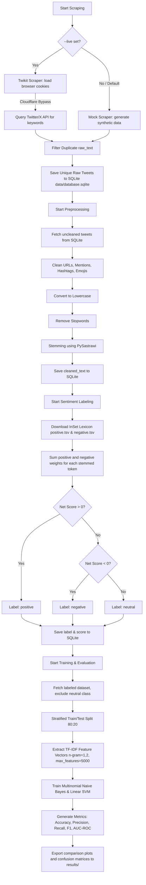

# Sentiment Analysis Pipeline: Makan Bergizi Gratis (MBG) on X (Twitter)

This project implements a modular sentiment analysis pipeline tailored to replicate the methodology from the academic research papers on the Indonesian government's **Makan Bergizi Gratis (MBG)** campaign. It compares **Multinomial Naive Bayes** and **Support Vector Machine (SVM)** algorithms using features extracted via a TF-IDF unigram-bigram model and labels generated automatically using the **InSet Lexicon** (with correct positive/negative weight accumulation).

Works natively on **Windows** and **macOS**.

---

## 1. System Architecture & Flow Logic

This pipeline is designed to be executed sequentially or end-to-end. The database holds raw, cleaned, and labeled data, keeping each stage independent and reviewable.

### Flow Diagram



---

## 2. Installation & Setup

### Prerequisites
*   Python 3.8 to Python 3.14 installed on your system.

### Step 1: Automatic Environment Setup
Run the automated environment setup script. It will automatically create the virtual environment, upgrade pip, install standard package requirements, and clone/patch/install the correct `twifork` client from git:

*   **macOS / Linux:**
    ```bash
    python3 setup_env.py
    ```
*   **Windows:**
    ```cmd
    python setup_env.py
    ```

### Step 2: Activate the Virtual Environment
Activate the environment to start running commands:

*   **macOS / Linux:**
    ```bash
    source venv/bin/activate
    ```
*   **Windows (Command Prompt):**
    ```cmd
    venv\Scripts\activate
    ```
*   **Windows (PowerShell):**
    ```powershell
    .\venv\Scripts\Activate.ps1
    ```

---

## 3. Configuration & Authentication (Cloudflare Bypass)

X.com uses Cloudflare WAF protection to prevent API scraping. To bypass this, we use two configuration files in the `config/` directory:
1.  **`config/credentials.json` (Manual Setup)**: Stores your account login details.
2.  **`config/cookies.json` (Exported from Browser)**: Contains session tokens that bypass the Cloudflare login wall.

---

### Step 1: Set Up Credentials (Manual)
Create a file named `config/credentials.json` and type your login credentials manually:
```json
{
  "username": "your_x_username",
  "email": "your_email_linked_to_x",
  "password": "your_x_password"
}
```

---

### Step 2: Export Browser Cookies (`cookies.json`)
Since you are already logged in via your web browser (Chrome, Edge, or Firefox), you can copy your browser session tokens.

#### A. Install a Cookie Exporter Extension
Install one of these standard extensions in your browser:
*   **Google Chrome / Microsoft Edge**: 
    *   [EditThisCookie](https://chromewebstore.google.com/detail/editthiscookie/fngmhnnpcljbackaeieabiahcombhbgo) or
    *   [Get cookies.txt LOCALLY](https://chromewebstore.google.com/detail/get-cookiestxt-locally/ccmddjjdcmgdhjomegbbjcjihihacmhd)
*   **Mozilla Firefox**:
    *   [Cookie Quick Manager](https://addons.mozilla.org/en-US/firefox/addon/cookie-quick-manager/)

#### B. Export Cookies from X.com
1.  Open your browser and navigate to [x.com](https://x.com) (make sure you are already logged in to your account).
2.  Click on the installed extension icon (e.g., **EditThisCookie**) in your browser's toolbar.
3.  Choose the **Export** option. 
    *   *If using EditThisCookie:* Go to the extension settings, verify that the **"Choose the preferred format for export"** is set to **JSON**, then click the **Export** button (it will copy the cookies to your clipboard).
    *   *If using Get cookies.txt LOCALLY:* Select the JSON export option and download/copy the content.
4.  Create a new file named `config/cookies.json` in your project folder.
5.  Paste the copied clipboard contents into `config/cookies.json` and save it.

*Note: The script ([twikit_scraper.py](src/scraper/twikit_scraper.py)) is equipped with an automatic parser that converts the browser-exported JSON array format into the flat dictionary format required by the Twikit/httpx library. You do not need to format it manually.*

---

## 4. How to Run the Pipeline

You can run the entire pipeline at once or step-by-step:

### A. Complete Run (Scrape $\rightarrow$ Clean $\rightarrow$ Label $\rightarrow$ Train)
To execute everything with mock data:
```bash
python main.py --mode run-all --limit 100
```
To execute everything with **live X (Twitter) data** (requires the credentials and cookies set up in Section 3):
```bash
python main.py --mode run-all --live --limit 20
```

### B. Step-by-Step Execution
1.  **Scraping**:
    ```bash
    # For Mock Scraping (Default/Offline)
    python main.py --mode scrape --limit 100
    
    # For Live Scraping (Real X data)
    python main.py --mode scrape --live --limit 20
    ```
2.  **Preprocessing**:
    ```bash
    python main.py --mode preprocess
    ```
3.  **Sentiment Labeling**:
    ```bash
    python main.py --mode label
    ```
4.  **Model Training**:
    ```bash
    python main.py --mode train
    ```

---

## 5. Utilities

### A. View Database (`view_db.py`)
To inspect the tables, distribution of labels, and latest records inside the SQLite database, run the helper script:

```bash
# View all records (default shows 5)
python view_db.py

# Filter only negative records and limit to 10
python view_db.py --label negative --limit 10

# Filter to show ONLY reply tweets (replying to another tweet)
python view_db.py --only-replies --limit 10

# Combine filters: only show negative replies
python view_db.py --label negative --only-replies --limit 5
```

### B. Resetting/Fresh Database
SQLite stores all database records in `data/database.sqlite`. To clear your dataset and start fresh, simply delete this file. It will be recreated automatically next time the scraper runs:

*   **macOS / Linux:** `rm data/database.sqlite`
*   **Windows (Command Prompt):** `del data\database.sqlite`
*   **Windows (PowerShell):** `Remove-Item data\database.sqlite`

---

## 6. Output Evaluation Artifacts
Model performance comparisons and visual results are exported to the `results/` directory:
*   `comparison_results.csv`: Evaluation metrics table (Accuracy, Precision, Recall, F1, and AUC-ROC).
*   `comparison_plot.png`: Performance comparison bar chart.
*   `nb_confusion_matrix.png`: Confusion matrix for the Naive Bayes model.
*   `svm_confusion_matrix.png`: Confusion matrix for the SVM model.
